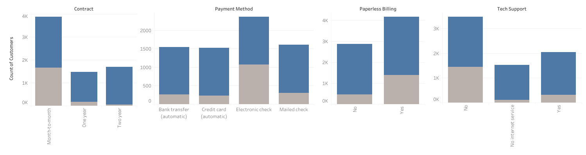
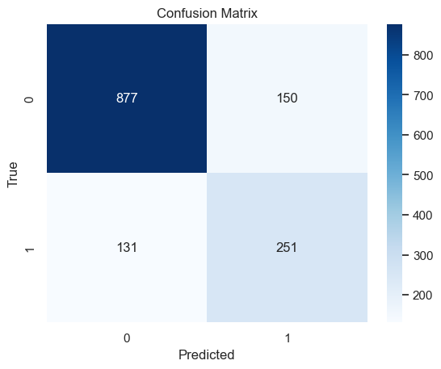

# Telco customer Churn Prediction
## Machine Learning: Classification problem - Supervised learning

---

## `Problem Statement` :
 

    Predict the potential churn customers based on numerical and categorical features.

 

Customer churn is of utmost importance for businesses due to the fact that retaining existing customers is generally more lucrative than acquiring new ones. Loyal customers are known to spend more and are also more likely to refer others to the company.

Particularly in the telecommunications industry, the cost difference between acquiring a new customer and retaining an existing one can be substantial. According to some estimates, it can be up to `five times more expensive` than retaining an existing one. This is because attracting new customers often requires significant marketing and advertising expenses, as well as the cost of providing incentives to entice them to switch from a competitor. In contrast, retaining existing customers generally involves providing good customer service, resolving any issues they may have, and providing them with incentives to stay with the company, such as loyalty programs or discounts.

Furthermore, in the telecom industry, there is often a high level of competition and low switching costs, meaning that customers can easily switch to a competitor if they are dissatisfied. Therefore, retaining existing customers is crucial for telecom companies to maintain their market share and profitability.

 

## `Dataset`:

The datasource analyzed is a dataset from Kaggle, which shows a snapshot of a set of customers from a telco company's in a given time.

The data set includes mainly the following information:

- A Churn flag indicating if the customer is active or not.
- Services that each customer has signed up for: phone, multiple lines, internet, online security, online backup, device protection, tech support, and streaming TV and movies
- Customer account information: how long they’ve been a customer, contract, payment method, paperless billing, monthly charges, and total charges
- Demographic info about customers: gender, age range, and if they have partners and dependents.
  
 

| |Feature|Description|
|:----|:----|:----|
|0|Customer ID|Contains customer ID|
|1|gender|Whether the customer is a male or a female|
|2|SeniorCitizen|Whether the customer is a senior citizen or not (1, 0)|
|3|Partner|Whether the customer has a partner or not (Yes, No)|
|4|Dependents|Whether the customer has dependents or not (Yes, No)|
|5|tenure|Number of months the customer has stayed with the company|
|6|PhoneService|Whether the customer has a phone service or not (Yes, No)|
|7|MultipleLines|Whether the customer has multiple lines or not (Yes, No, No phone service)|
|8|InternetService|Customer’s internet service provider (DSL, Fiber optic, No)|
|9|OnlineSecurity|Whether the customer has online security or not (Yes, No, No internet service)|
|10|OnlineBackup|Whether the customer has online backup or not (Yes, No, No internet service)|
|11|DeviceProtection|Whether the customer has device protection or not (Yes, No, No internet service)|
|12|TechSupport|Whether the customer has tech support or not (Yes, No, No internet service)|
|13|streamingTV|Whether the customer has streaming TV or not (Yes, No, No internet service)|
|14|streamingMovies|Whether the customer has streaming movies or not (Yes, No, No internet service)|
|15|Contract|The contract term of the customer (Month-to-month, One year, Two year)|
|16|PaperlessBilling|Whether the customer has paperless billing or not (Yes, No)|
|17|PaymentMethod|The customer’s payment method (Electronic check, Mailed check, Bank transfer, Credit card)|
|18|MonthlyCharges|The amount charged to the customer monthly|
|19|TotalCharges|The total amount charged to the customer|
|20|Churn|Whether the customer churned or not (Yes or No)|

 
 

## `Exploratory Data Analysis`

 

- 7043 observations.
- There was a small amount of null values in `TotalCharges` that were approximated using following relationship: `TotalCharges` ~ `MonthlyCharges` * `tenure`
- Other than `tenure`, `MonthlyCharges` and `TotalCharges`, all variables are categorical.
- No duplicate rows were found.

 

 
 

### `Numerical Variables`
 

#### `tenure` 

- distribution concentrates values on the extremes (min/max)
- There's a clear concentration on churned users on the min tenure values vs non churned users who have spikes both at min and max values
    - this suggests tenure could be a relevant feature to predict Churn

**anderson_normality_test**  (There's already clear visual evidence this feature is not normal):

- Test statistic: 203.2354707966997
- Critical value at 5%: 0.656
- Data does not look Gaussian (reject H0)

>

 
 

#### `MonthlyCharges` 

- There's concentration or churned users within the 60-110 monthly charges rate, seems relevant to segment clients correctly in order to address clients with a higher price-sensitivity in a more personalized way

**anderson_normality_test** (There's already clear visual evidence this feature is not normal):

- Test statistic: 170.555235072914
- Critical value at 5%: 0.656
- Data does not look Gaussian (reject H0)

 
 

#### `TotalCharges` 

- No apparent insight regarding churn, the distribution is clearly right skewed.

**anderson_normality_test** (There's already clear visual evidence this feature is not normal):

- Test statistic: 346.6380297042033
- Critical value at 5%: 0.656
- Data does not look Gaussian (reject H0)

 
 

#### `ExtraChargesEstimate` 

- Given that there's a linear relationship between `MonthlyCharges` , `tenure` and `TotalCharges`, i added this feature which captures the difference between the product of MonthlyCharges and `tenure` with `TotalCharges`, in order to drop `TotalCharges` moving forward and avoid multicollinearity
- Although not gaussian according to the anderson test due to its heavy kurtosis, its the numeric variable with the closest to a normal distribution.

**anderson_normality_test**

- Test statistic: 130.869284893427
- Critical value at 5%: 0.656
- Data does not look Gaussian (reject H0)

 

 
 

### `Categorical Variables`

 

`main takeouts`

1- Crosseling clearly contributes to churn reduction, leaving out streaming services.

2- Contract type and payment options are considerably relevant, with Month-to-Month based Contract, PaperlessBilling particularly with Electronic check seem to be churn drivers.

------------- 
#### User Demographics
 

 

- Gender has exacly the same proportion in each case, irrelevant feature.
- No dependants have a higher churn proportion.
- Partners have a consistent proportion for each category.
- Senior citizens have a higher churn proportion.

 

#### Contract/Payment
 

 

- Customer with a Month-to-Month based Contract churned the most in this category
- A high number of customers have switched their service provider when it comes down TechSupport
- PaperlessBilling displays a high proportion of customers churning
- Customers using Electronic check as PaymentMethod churned heavily.

 

#### Products suite

 

 

- MultipleLines has a slightly less proportion of churned users than other categories within this feature.
- InternetService: Fiber optic is clearly a pain point.
- StreamingTV and StreamingMovies show the same proportions, doesn't seem relevant for churn.
- A high proportion of customers without OnlineSecurity, OnlineBackup and DeviceProtection churned.

 

## `Feature Engineering`
----------------
  

### `Categorical Encoding`  

 

Categorical encoding is necessary because many machine learning algorithms cannot directly handle categorical variables, which are variables that take on a finite set of values rather than numeric values. To use categorical variables in machine learning models, they must first be transformed into a numerical representation. This process is called encoding. There are several encoding techniques available, each with its own advantages and disadvantages. 

Given that our dataset has features with max 3 categories per feature, i used One-Hot Encoding for binary features and label encoding for the rest.

`One-Hot Encoding:` This technique creates a binary vector for each category, with a 1 indicating the presence of the category and a 0 indicating the absence. One-hot encoding works well for categorical variables with a small number of categories.

`Label Encoding`: This technique assigns a unique integer value to each category. Label encoding works well for categorical variables with a large number of categories.

 

|Feature|Values|count_val|
|:---:|:---:|:---:|
|0|gender|[Female, Male]|2|
|1|Partner|[Yes, No]|2|
|2|Dependents|[No, Yes]|2|
|3|PhoneService|[No, Yes]|2|
|4|MultipleLines|[No phone service, No, Yes]|3|
|5|InternetService|[DSL, Fiber optic, No]|3|
|6|OnlineSecurity|[No, Yes, No internet service]|3|
|7|OnlineBackup|[Yes, No, No internet service]|3|
|8|DeviceProtection|[No, Yes, No internet service]|3|
|9|TechSupport|[No, Yes, No internet service]|3|
|10|StreamingTV|[No, Yes, No internet service]|3|
|11|StreamingMovies|[No, Yes, No internet service]|3|
|12|Contract|[Month-to-month, One year, Two year]|3|
|13|PaperlessBilling|[Yes, No]|2|
|14|PaymentMethod|[Electronic check, Mailed check, Bank transfer (automatic), Credit card (automatic)]|4|
|15|Churn|[No, Yes]|2|

 

### `Scaling Numeric Variables`

Given that we are going to predict churn using this numerical variables, it is recommended to scale them because many machine learning algorithms rely on distance measures between data points to make predictions. If the numerical variables have different scales, it can lead to inaccuracies in the distance measures and ultimately affect the performance of the model.

  `MinMaxScaler`: This scaler scales the data to a fixed range of 0 to 1. I will use this scaler, given that the data is positive and non-Gaussian.

### `Avoiding Multicollinearity:`
 

Looking for variables with correlation higher than 0.7

- TotalCharges has a high correlation with tenure (Logical)
- TotalCharges has a high correlation with Monthly charges

TotalCharges should be dropped, as it doesn't add additional info and its correlated with other variables `(TotalCharges = MontlyCharges * Tenure + ExtraChargesEstimate)`.
 
 
>

### `Correlation of each variable vs Churn`:

The following features show a very low level of correlation:

    - Multiple lines
    - Phone Service
    - ExtraChargesEstimate
    - Gender
    - StreamingTV
    - StreamingMovies
    - Internet service

  

### `Testing Significance for Categorical Variables: Chi-Squared test`

The chi-squared test is a statistical test that can be used to determine if there is a relationship between two categorical variables. It is often used to test the independence between a categorical feature and a categorical target variable in a classification problem.

- `PhoneService` and `Gender` have a P-Value less than 5%, suggesting that they shouldn't be considered

| |feature|p_value|
|:---:|:---:|:---:|
|3|PhoneService|0.33878253580669281941|
|0|gender|0.48657873605618595647|

  

### `Testing Significance for Numerical Variables: ANOVA`
 
In the context of an ANOVA analysis between numerical variables and a binary categorical target variable, a low p-value indicates that there is a statistically significant difference between the means of the groups defined by the binary variable.

in this case, ExtraChargesEstimate has a p-value higher than the significance level 5%, suggesting that we shouldn't consider it as a relevant feature for the analysis.

 

**tenure**: p-value = 7.999057960585883e-205

**MonthlyCharges**: p-value = 2.706645606885165e-60

**TotalCharges**: p-value = 2.1272116132436084e-63

**ExtraChargesEstimate**: p-value = 0.979456099901503

### `Dropping non significant features:`
 

- 'PhoneService'
- 'ExtraChargesEstimate'
- 'gender'
- 'TotalCharges'

 

### `Target Variable: the imbalance problem`
 
This classification task has a clear problem: the number of churned customers is much smaller than the number of non-churned customers. This can lead to biased models that predict the majority class more frequently. Several techniques such as oversampling, undersampling, and cost-sensitive learning will be analyzed to mitigate this problem and improve the accuracy of the models.

4 possible options chosen: 

- Base scenario (no Over-Sampling),
- SMOTE with sampling_strategy=0.5 
- SMOTE with sampling_strategy=1
- Undersampling - Random Undersampling

 

 
  

## Modelling
------------------------

### **Measuring model performance**

*The overall accuracy of the model was be inferred from the averages of the precision, recall and f1-score metrics.*

 

`Precision`: the proportion of predicted positive instances that are actually positive. It measures the model's accuracy in predicting positive instances.

`Recall`: the proportion of actual positive instances that are correctly predicted as positive. It measures the model's completeness in predicting positive instances.

`F1-score`: the harmonic mean of precision and recall. It provides a balanced measure of both precision and recall.

`ROC AUC`: (Receiver Operating Characteristic Area Under Curve) is a performance metric commonly used in binary classification problems to evaluate the ability of a model to distinguish between positive and negative classes. ROC AUC is a measure of the model's ability to correctly rank true positives (TP) higher than false positives (FP) across a range of decision thresholds.

 

### **Machine Learning Pipeline**

Given that getting the best model possible without overfitting with such a heavy class imbalance, i iterated over several sampling, models, parameters and feature reduction options to get the best result possible. I benchmarked this with an AutoML package (H20).

This Pipeline works on the preprocessed data given the following inputs:

- **List of resamples:**
    - No resampling
    - SMOTE = 0.5
    - SMOTE = 1
    - Random undersampling

 

- **List of Classification Machine Learning models:**

    - LogisticRegression

        A linear model that uses a logistic function to model the probability of the positive class. Useful for its simplicity, interpretability, and speed. Can be regularized to prevent overfitting.
    
    - RandomForestClassifier

        An ensemble model that combines multiple decision trees to improve accuracy and reduce overfitting. Useful for its flexibility, interpretability, and resistance to outliers. Can handle class imbalance with weighting or sampling.
    
    - GradientBoostingClassifier

        An ensemble model that combines multiple weak models (e.g., decision trees) in a sequential manner to improve accuracy. Useful for its high accuracy, flexibility, and ability to handle different types of data. Can handle class imbalance with weighting or sampling.

    - XGBClassifier

        A gradient boosting model that uses optimized distributed gradient boosting algorithms to improve accuracy and reduce computation time. Useful for large and complex datasets, with high accuracy and good scalability. Can handle class imbalance with weighting or sampling.

    - MLPClassifier

        A neural network model that uses multiple layers of nodes to model complex non-linear relationships in the data. Useful for its flexibility, ability to handle different types of data, and high accuracy. Can handle class imbalance with weighting or resampling. Can be sensitive to the choice of hyperparameters and prone to overfitting.

 

- **List of Parameters** per Machine Learning model to use in Gridsearch, aligned to the classification problem at hand

- **List of Feature importance** level filtering.

 

### `Top 5 results`
 

The GradientBoostingClassifier model with Oversampling and Default parameters has the highest F1 score. As the other models, given this sample with such a low % of positive Churn cases, it struggles to get a high precision level (TruePositives / (TruePositives + FalsePositives)), although it gets a high recall value (TruePositives / (TruePositives + FalseNegatives)).

    Recall measures the ability of the model to identify all positive instances correctly. Given the problem context (Telco companies spend up to 4 times more to get a new customer than retaining one), a false negative (predicting a customer won't churn when they actually will) would probably lead to the loss of a customer and potential revenue, which would be more costly than a false positive (predicting a customer will churn when they actually won't).
 

| |sampling|ROC_AUC|accuracy|precision|recall|f1_score|model|params|
|:----|:----|:----|:----|:----|:----|:----|:----|:----|
|1|Oversampling05|0.84747|0.80057|0.62594|0.65707|0.64112|GradientBoostingClassifier|NaN|
|2|gridsearch|0.82840|0.74521|0.51901|0.82199|0.63627|GradientBoostingClassifier|{'learning_rate': 0.01, 'max_depth': 10, 'max_features': 'log2', 'min_samples_leaf': 4, 'min_samples_split': 5, 'n_estimators': 500}|
|3|Undersampling|0.85058|0.74521|0.51901|0.82199|0.63627|GradientBoostingClassifier|NaN|
|4|feature_reduction|0.85007|0.74663|0.52087|0.81675|0.63609|XGBClassifier|0.00000|
|5|Oversampling05|0.83622|0.78850|0.60000|0.65969|0.62843|LogisticRegression|NaN|

 

**AutoML (H20) Package to benchmark results**
 
 
| |sampling|ROC_AUC|accuracy|precision|recall|f1_score|model|params|
|:---:|:---:|:---:|:---:|:---:|:---:|:---:|:---:|:---:|
|1|Original Sample|0.8147475|0.749828|0.5231197|0.7132375|0.6014422|StackedEnsemble_|NaN|

. | .
:---------:|:------:
 |  
 

### **Feature Importance Table**
 

|features|importance|
|:----|:----|
|Contract|0.47403|
|tenure|0.16402|
|MonthlyCharges|0.14029|
|OnlineSecurity|0.07113|
|TechSupport|0.06648|
|PaymentMethod|0.02326|
|InternetService|0.01426|
|OnlineBackup|0.01342|
|Dependents|0.00895|
|MultipleLines|0.00856|
|PaperlessBilling|0.00536|
|StreamingMovies|0.00362|
|SeniorCitizen|0.00313|
|Partner|0.00281|
|DeviceProtection|0.00039|
|StreamingTV|0.00029|

  

## `Main Takeouts`

- The model has an acceptable level of accuracy, outperforming AutoML H20, although adding more data or manipulating the dataset using domain knowledge would probably increase its overall performance.
- A quick win should be to desincentivize Electronic Check as a payment method, and incentivize longer Contracts.
- As shown in the EDA, the contract type, tenure and MonthlyCharges are the most relevant features related to the target variable churn
- Regarding services, the most relevant are TechSupport and OnlineSecurity, although crosseling as a whole contributes to churn reduction.

  
  
  
  
  
  
  
  
  
  
  
  
 

---------------------------------------------------
## Machine Learning models annex:

 

`LogisticRegression`

A linear model that uses a logistic function to model the probability of the positive class. Useful for its simplicity, interpretability, and speed. Can be regularized to prevent overfitting.
    
- `C`: This is the inverse of regularization strength. It controls the tradeoff between fitting the training data well and avoiding overfitting. Smaller values of C will result in stronger regularization, while larger values of C will result in less regularization.
- `solver`: This parameter specifies the algorithm to use in the optimization problem when training the logistic regression model.
- `max_iter`: This parameter specifies the maximum number of iterations for the solver to converge.
- `class_weight`: This parameter specifies the weight of each class in the loss function during training. By default, all classes are given equal weight. However, when dealing with class imbalance, it can be useful to adjust the weights to give more importance to the minority class. Setting this parameter to 'balanced' automatically adjusts the weights to be inversely proportional to the class frequencies in the training data.

`RandomForestClassifier`

 An ensemble model that combines multiple decision trees to improve accuracy and reduce overfitting. Useful for its flexibility, interpretability, and resistance to outliers. Can handle class imbalance with weighting or sampling.

- `n_estimators`: This parameter specifies the number of trees in the random forest. Increasing the number of trees can improve the performance of the model, but also increase the computational time
- `max_features`: The maximum number of features to consider when looking for the best split at each node. The algorithm randomly selects max_features features from the feature set and determines the best split based on those features.
- `max_depth`: This parameter controls the maximum depth of each tree in the random forest. A deeper tree can capture more complex relationships in the data, but may also overfit. 
- `min_samples_split`: This parameter controls the minimum number of samples required to split an internal node. Increasing this parameter can reduce overfitting by requiring more samples for a split, but may also result in a simpler tree. 
- `class_weight`: This parameter can be set to 'balanced' to automatically adjust the weights of each class based on their frequency in the data. This can help to address class imbalance issues in the data.

`GradientBoostingClassifier`

An ensemble model that combines multiple weak models (e.g., decision trees) in a sequential manner to improve accuracy. Useful for its high accuracy, flexibility, and ability to handle different types of data. Can handle class imbalance with weighting or sampling.

- `n_estimators`: This parameter specifies the number of trees in the random forest. Increasing the number of trees can improve the performance of the model, but also increase the computational time
- `learning_rate`: the step size at which the boosting algorithm applies corrections to the model. It is a list of floats containing the possible values for the learning rate.
- `max_features`: The maximum number of features to consider when looking for the best split at each node. The algorithm randomly selects max_features features from the feature set and determines the best split based on those features.
- `max_depth`: This parameter controls the maximum depth of each tree in the random forest. A deeper tree can capture more complex relationships in the data, but may also overfit. 
- `min_samples_leaf`: the minimum number of samples required to be at a leaf node. It is a list of integers containing the possible values for the minimum number of samples required to be at a leaf node.

`XGBClassifier`

A gradient boosting model that uses optimized distributed gradient boosting algorithms to improve accuracy and reduce computation time. Useful for large and complex datasets, with high accuracy and good scalability. Can handle class imbalance with weighting or sampling.

- `max_depth`: Maximum depth of a tree. Increasing this value will make the model more complex and prone to overfitting.
- `learning_rate`: The step size shrinkage used to prevent overfitting. Smaller values are generally preferred as they make the model more robust to new data.
- `n_estimators`: Number of trees to fit.
- `gamma`: Minimum loss reduction required to make a split. Increasing this value will make the algorithm more conservative.
- `subsample`: Subsample ratio of the training instances. Lower values make the algorithm more conservative and prevent overfitting.
- `colsample_bytree`: Subsample ratio of columns when constructing each tree.
- `reg_alpha`: L1 regularization term on weights. Increasing this value will make the model more conservative.
- `scale_pos_weight`: Control the balance of positive and negative weights, useful for unbalanced classes. A value greater than 1 can be used to add more weight to positive cases.

`MLPClassifier`

A neural network model that uses multiple layers of nodes to model complex non-linear relationships in the data. Useful for its flexibility, ability to handle different types of data, and high accuracy. Can handle class imbalance with weighting or resampling. Can be sensitive to the choice of hyperparameters and prone to overfitting.

- `hidden_layer_sizes`: Specifies the number of neurons in each hidden layer of the MLP. It is a tuple or list of tuples, where each tuple represents the number of neurons in a single hidden layer. For example, (50,50) specifies two hidden layers with 50 neurons each, while (100,) specifies one hidden layer with 100 neurons.
- `activation`: This parameter specifies the activation function used in the hidden layers.'relu' and 'tanh' are commonly used for classification tasks.
- `alpha`: Specifies the L2 regularization parameter. It is used to prevent overfitting by penalizing large weights in the network.
- `solver`: Specifies the optimizer algorithm used to update the weights in the network. 'adam' and 'lbfgs' are commonly used optimizers.
- `learning_rate_init`: Specifies the initial learning rate used by the optimizer. It controls the step size of weight updates during training.
- `max_iter`: Specifies the maximum number of iterations for the solver to converge. If the solver does not converge before reaching this maximum, it will stop training.
- `random_state`: Specifies the random seed used to initialize the weights of the MLP. It ensures reproducibility of the results.

---------------------------------------------------
Problem statement sources:

"The Value of Keeping the Right Customers" by Harvard Business Review
(https://hbr.org/2014/10/the-value-of-keeping-the-right-customers)

"Understanding the Economics of Telecom Customer Acquisition and Retention" by McKinsey & Company (https://www.mckinsey.com/industries/telecommunications/our-insights/understanding-the-economics-of-telecom-customer-acquisition-and-retention)

"Customer Acquisition vs. Retention Costs – Statistics And Trends" by Invesp (https://www.invespcro.com/blog/customer-acquisition-retention/)

"Customer Acquisition vs. Retention: Which Costs More and What Can You Do About It?" by SuperOffice (https://www.superoffice.com/blog/customer-acquisition-vs-retention/)